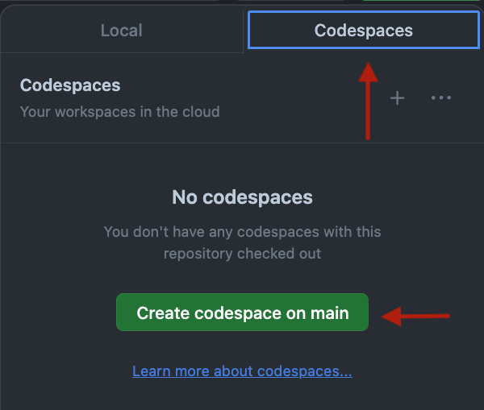
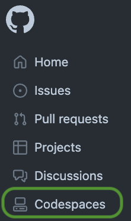

# HTML Elements and Tags Lab 1

## Description 📄
This lab introduces you to the fundamental building blocks of HTML webpages. You'll experiment with creating a simple webpage structure and observe how basic code translates into visual elements on a web page.

---

## Developer Objectives 📋
1. **File Navigation:** Navigate to index.html.
2. **Boilerplate Generation:** Use shortcuts to generate HTML boilerplate.
3. **Header Tag Insertion:** Insert appropriate header tag based on its function.
4. **Paragraph Tags Insertion:** Insert a paragraph tags with the given copy.

---

## Setup Instructions for Codespaces 🛠️
#### Forking the Repository
1. Click the Fork button at the top-right of the repository page to create a copy under your GitHub account.

#### Open Codespaces:
2. Wait for the Code button to appear on your forked repository page.

3. Click the Code button and select Open with Codespaces.

#### Starting the Development Server (Port)
4.  In the terminal, type the following command to start the server: `npx serve .`

5. When prompted, type y and press return / enter.

#### Open the Webpage:
6. Navigate to the Ports section where the terminal is.

7. Click on the globe icon to open the webpage and render your code.

---

## ToDo list ✅
**Attention**: When you complete a task, put an `x` in the middle of the brackets to mark it off your ToDo list.

1. [ ] Navigate to the `index.html` file. 
2. [ ] In line 1, type an exclamation point, wait to see the prompt, then hit `enter`.
3. [ ] Inside the body tag, put the appropriate header tag for a main header with the copy: 
   `Hello World!`
4. [ ] Under that, put a paragraph tag under that and copy and paste:
    `World, this is my first time coding!`
5. [ ] Write another paragraph tag under the previous and copy and pastethis copy:
   `I'm ready to learn a lot!`

🎊 **Fantastic work! You just finished your first ever HTML coding demo.** 🎊

---

## Maintaining Your Codespaces ⚙️
You can only have 2 active Codespaces at a time in GitHub. Here are steps to show how you maintain them. 

#### Locating your active codespaces in GitHub
1. Locate the hamburger menu at the top left of the GitHub website and click it. 

2. Then click 'Codespaces' from options.

3. Using the three dot menu, you can manage, close, delete, etc. your codespaces there. 
🛑 **Make sure to not use up your cores so keep track of them.** 🛑

## ATTENTION 

### Solution codebase 👀
🛑 **Only use this as a reference** 🛑

💾 **Not something to copy and paste** 💾

**Note:**  This lab references a solution file located [here](https://github.com/HackerUSA-CE/sdai-ic-d1-html-elements-1/blob/demo-solution/index.html) (link not shown).
